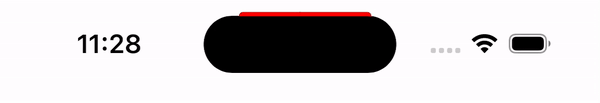
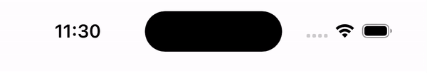

# DynamicIslandUtilities

A collection of utilities that provides functionality around the Dynamic Island on the iPhone 14 Pro/Max.

I will be adding more utilities to this package in the near future.

# Utilities

## DynamicIsland

A type that provides the size, origin and rect for the Dynamic Island. For example, you can do:

```swift
let size = DynamicIsland.size
```

to get the size of the Dynamic Island cutout. This size is the same on both the iPhone 14 Pro and Max.

> **Warning**
> At the moment, this provides the static size of the island, not the dynamic size (the island will expand if there's a live activity running).

## DynamicIslandProgressIndicatorViewController

A `UIViewController` that provides a progress indicator around the Dynamic Island cutout.

To use it, simply subclass the view controller. You can subclass it even if you're not targetting iOS 16 yet, the minimum requirement is iOS 11.

In order to control the progress indicator, you need to use the configuration object by accessing `dynamicIslandProgressIndicatorConfiguration`, which will return a view into the progress indicator, allowing you to tweak the color, progress value/visibility or show an indeterminate animation.

```swift
dynamicIslandProgressIndicatorConfiguration.progressColor = .green
dynamicIslandProgressIndicatorConfiguration.isProgressIndeterminate = false

// Manual progress

doFixedWork { currentProgress in 
  if currentProgress == 100 {
    dynamicIslandProgressIndicatorConfiguration.hideProgressIndicator()
  } else {
    dynamicIslandProgressIndicatorConfiguration.progress = currentProgress
  }
}

/// Indeterminate progress

dynamicIslandProgressIndicatorConfiguration.showIndeterminateProgressAnimation()
doSomeWorkThatMayFinishLater { result in
 ...
 dynamicIslandProgressIndicatorConfiguration.hideProgressIndicator()
}
```

In order to call this method, you need to check `hasDynamicIsland` (this is enforced at runtime), which also allows you to provide fallback logic:

```swift
if hasDynamicIsland {
  // Show a cool progress indicator around the Dynamic Island
  dynamicIslandProgressIndicatorConfiguration.showIndeterminateProgressAnimation()
} else {
  // Fallback to a default indicator
  showIndeterminateProgressBar()
}
```

Example:

### Indeterminate 



### Manual



> **Note**
> If you're using SwiftUI, I will be providing a native version for that soon. In the meantime, you can wrap the view controller manually.


# Requirements

- Swift Package Manager
- Xcode 14
